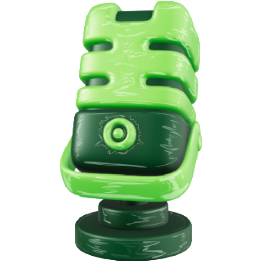

<div align="center">



# ShowMe

### *say it. it opens.*

**A lightweight, offline, always-on voice launcher for Windows.**  
No cloud. No subscriptions. No wake words. Just your voice.

</div>

---

> ***📢 Note: ShowMe runs entirely on your voice. Speech recognition accuracy may vary from person to person based on accent, microphone quality, and pronunciation. If an app isn't being recognized correctly, you can train it yourself — simply add the misheard phrase and its target app to `CUSTOM_MAPPINGS` in `config.py`.***

---

## 🎯 What It Does

You speak. It opens. That's it.

```
"show me chrome"          →  Google Chrome opens
"show me explorer"        →  File Explorer opens
"show me spotify"         →  Spotify opens
"show me need for speed"  →  Game launches
"show me calculator"      →  Calculator opens
"show me settings"        →  Windows Settings opens
```

No hotkey to hold. No button to press. No "Hey Cortana". Just say **show me** followed by anything installed on your machine.

---

## ✨ Why ShowMe

| | ShowMe | Cortana | Copilot |
|---|---|---|---|
| Always listening | ✓ | ✓ | ✗ |
| Fully offline | ✓ | ✗ | ✗ |
| RAM usage | ~250MB | 400MB+ | 600MB+ |
| Internet required | Never | Always | Always |
| Open source | ✓ | ✗ | ✗ |
| Free forever | ✓ | ✗ | ✗ |

---

## 🚀 Getting Started

### Prerequisites

- Windows 10 or 11
- Python 3.10+
- A microphone

### Installation

**1. Clone the repository**

```bash
git clone https://github.com/thattimelessman/ShowMe.git
cd ShowMe
```

**2. Create a virtual environment**

```powershell
python -m venv .venv
.venv\Scripts\activate
```

**3. Install dependencies**

```powershell
pip install -r requirements.txt
```

**4. Download the Vosk speech model**

Go to [https://alphacephei.com/vosk/models](https://alphacephei.com/vosk/models)  
Download `vosk-model-small-en-us-0.15` (~40MB)  
Unzip it into the `model/` folder:

```
ShowMe/
└── model/
    └── vosk-model-small-en-us-0.15/
```

**5. Run**

```powershell
python main.py
```

ShowMe will appear in your system tray. Say *"show me chrome"* and watch it work.

---

## 🗂️ Project Structure

```
ShowMe/
│
├── core/
│   ├── listener.py          # Vosk mic stream — always running
│   ├── parser.py            # extracts target from "show me ___"
│   └── executor.py          # launches the matched app
│
├── apps/
│   ├── scanner.py           # scans Windows Registry + Start Menu
│   ├── matcher.py           # fuzzy matches voice input to app
│   └── app_cache.json       # generated on first run
│
├── commands/
│   ├── open_app.py          # app launch command
│   └── show_weather.py      # weather overlay (optional)
│
├── frontend/
│   ├── tray.py              # system tray icon
│   ├── settings_window.py   # settings UI
│   └── overlay.py           # floating notification card
│
├── assets/
│   ├── icon_green.png       # tray icon — listening
│   └── icon_red.png         # tray icon — paused
│
├── model/                   # Vosk model goes here (not included)
├── config.py                # all settings and custom mappings
├── main.py                  # entry point
├── showme.pyw               # silent background launcher
└── requirements.txt
```

---

## ⚙️ Configuration

All settings live in `config.py`.

### Match Sensitivity

```python
MATCH_THRESHOLD = 85   # 50–95. Lower = more lenient. Higher = stricter.
```

### Custom Voice Mappings

If ShowMe mishears an app name, add it here:

```python
CUSTOM_MAPPINGS = {
    "exploded"        : "file explorer",   # Vosk mishears "explorer"
    "be l c"          : "vlc media player", # Vosk mishears "vlc"
    "what sub"        : "whatsapp",
    "vs code"         : "visual studio code",
    "nfs"             : "need for speed - most wanted",
    # add your own below
}
```

### Weather (Optional)

```python
WEATHER_API_KEY = "your_openweathermap_key"
WEATHER_CITY    = "New Delhi"
```

---

## 🖥️ Settings Window

Right-click the tray icon → **Settings** to access:

- **Dashboard** — total commands fired, today's count, most opened app, full indexed app list with search
- **Commands** — add custom voice → app mappings with live autocomplete, delete any existing mapping
- **Settings** — adjust match sensitivity slider, choose microphone, toggle Windows autostart
- **Test Mic** — speak and see exactly what ShowMe hears in real time

---

## 🔧 How It Works

```
Microphone input (continuous)
        ↓
Vosk — offline speech recognition (~250MB RAM, 0% idle CPU)
        ↓
Parser detects "show me ___"
        ↓
Rapidfuzz fuzzy matches the target against 100+ indexed apps
        ↓
Executor launches the app via subprocess or Windows URI
        ↓
Done — under 1 second from trigger to launch
```

ShowMe runs three threads:

- **Main thread** — PyQt6 tray UI
- **Listener thread** — Vosk mic stream, always running
- **Scanner thread** — builds app cache on startup, then sleeps

---

## 📦 Packaging to .exe

```powershell
pip install pyinstaller
pyinstaller --onefile --windowed --icon=assets/icon_green.png main.py
```

The installer will be in `dist/main.exe`. Distribute that.

---

## 🗺️ Roadmap

- [x] "show me [app]" — opens any installed app
- [x] System tray with pause/resume
- [x] Auto-start on Windows login
- [x] Settings UI with app list, sensitivity slider, mic selector
- [x] Custom voice command mapping
- [x] Live mic test
- [x] Stats dashboard
- [ ] "show me weather" — weather overlay card
- [ ] "show me my day" — calendar integration
- [ ] Android version
- [ ] Multi-language support
- [ ] NPU acceleration for lower RAM usage

---

## 🤝 Contributing

ShowMe is open source and welcomes contributions.

```bash
# Fork the repo
# Create your branch
git checkout -b feature/your-feature

# Commit your changes
git commit -m "feat: your feature"

# Push and open a PR
git push origin feature/your-feature
```

Things that would genuinely help:

- Adding more `CUSTOM_MAPPINGS` for common mishearings
- Testing on different accents and microphones
- Android port
- Language support beyond English

---

## 📄 License

Licensed under the **Apache License 2.0** — see [LICENSE](LICENSE) for the full text.

Build on it. Contribute to it.

---

## 👤 Built By

**Agraj Singh** · [@thattimelessman](https://github.com/thattimelessman)

> *"I didn't build this for a grade. I built it because I grew up watching Iron Man."*

---

<div align="center">

*ShowMe is free. It always will be.*

**⭐ Star this if ShowMe saved you even one unnecessary mouse click.**

---

**Note: Stealing or copying this project would be deeply unappreciated.**

---

*Made with brains, for every Number Cruncher.*

</div>